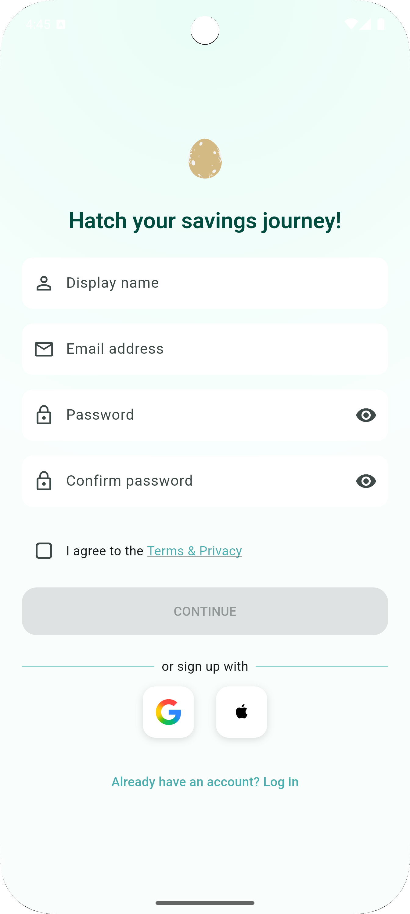
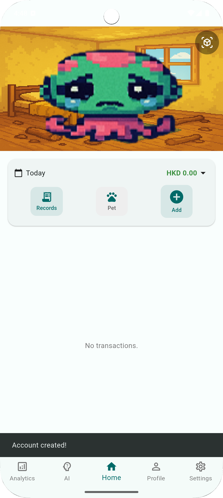
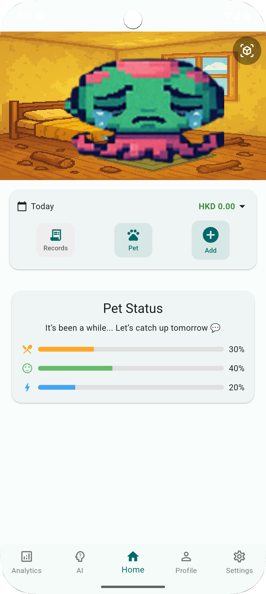
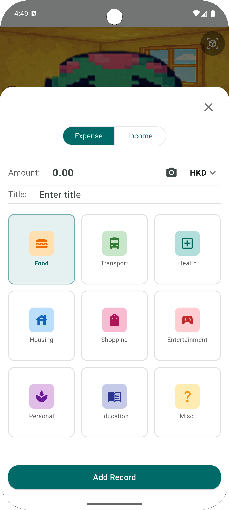
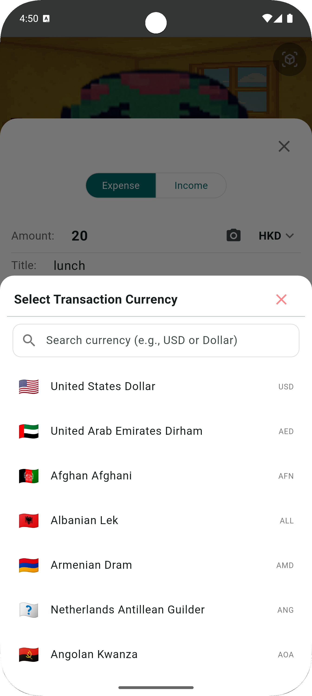
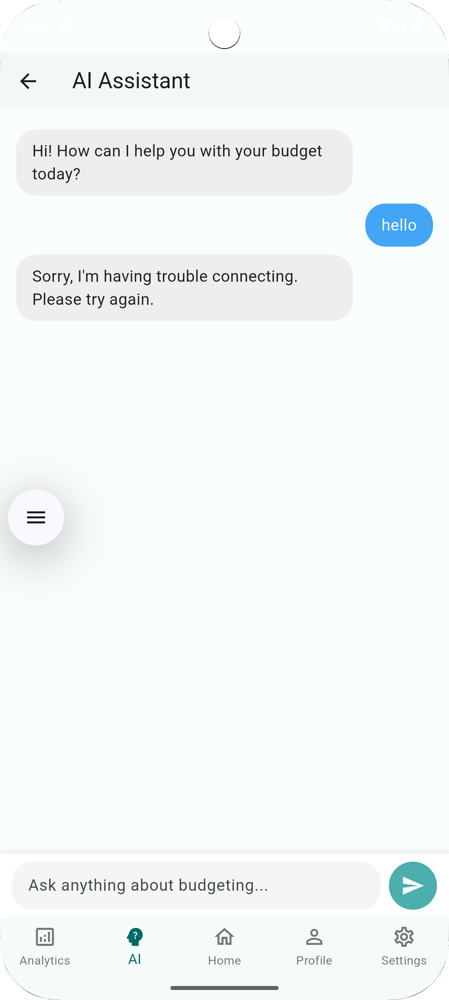
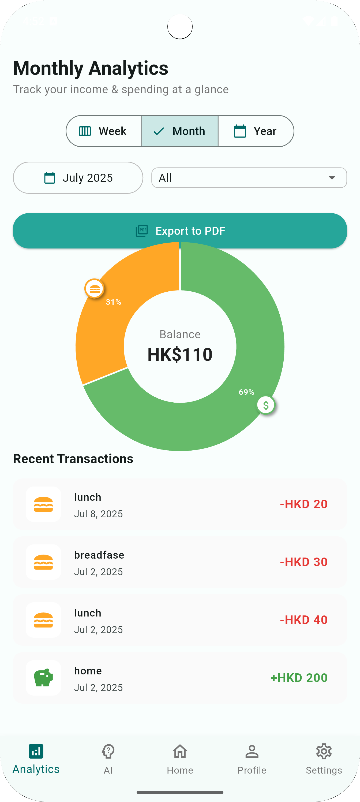
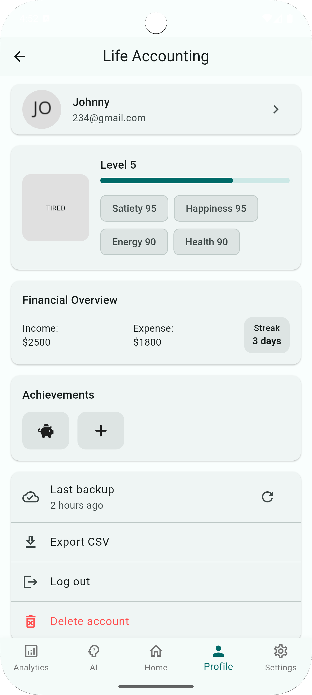
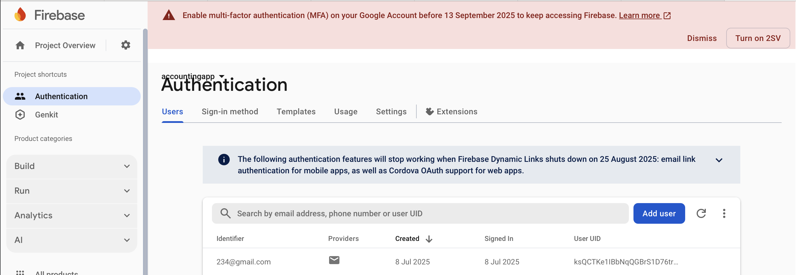
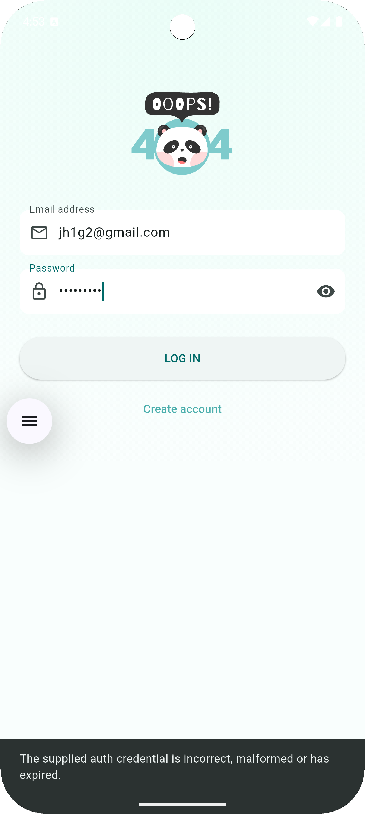

# accounting_app 💰🐾

A Flutter app that turns everyday budgeting into a **playful pet-care game**.  
Track income & expenses, visualise analytics, and keep your e-pet healthy by saving money!

---

## ✨ Core Features

| Area | What it does |
|------|--------------|
| 🔑 **Sign-up / Login** | Firebase Auth secures your account. Cute “egg” animation welcomes new users. |
| 🏠 **Home dashboard** | Today’s balance, expense list, and your e-pet’s current mood (satiety & happiness). |
| ➕ **Add transaction** | Record income or expense in a few taps. |
| 💱 **Multi-currency** | Instantly switch currencies for travel or overseas purchases. |
| 🤖 **AI chatbot** | Ask budgeting questions via OpenAI Chat API. |
| 📊 **Analytics** | Visual summaries of spending habits and trends. |
| 👤 **Profile** | View personal data and adjust settings. |

---

## 🖼️ Screenshots

### 1 · Sign-up (egg animation)


### 2 · Sign-up (data filled & saved to Firebase)
.png)

### 3 · Home – today’s balance & pet


### 4 · Pet status (hunger & happiness)


### 5 · Add income / expense


### 6 · Currency switcher


### 7 · AI Chatbot


### 8 · Analytics


### 9 · Profile


### 10 · Login screen


### 11 · Firebase data view


### 12 · Login error (animation on failure)


---

## 🛠️ Tech Stack

- **Flutter / Dart** – cross-platform UI  
- **Firebase** – Auth & Cloud Firestore  
- **OpenAI Chat API** – budgeting assistant  
- **Provider** – state management  
- **Intl** – multi-currency formatting  

---

## 🚀 Getting Started

```bash
# Clone repo
git clone https://github.com/your-username/accounting_app.git
cd accounting_app

# Install dependencies
flutter pub get

# Run on connected device
flutter run
