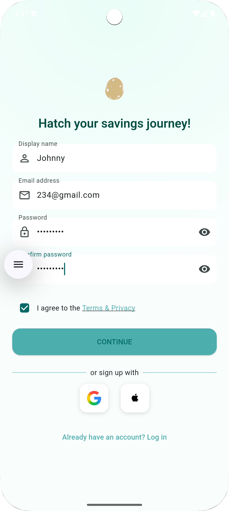
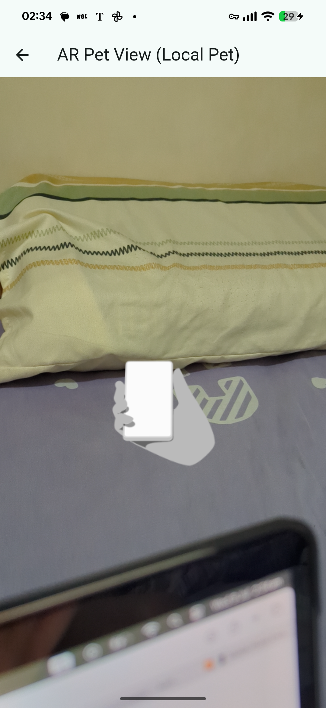

# accounting_app 💰🐾


A Flutter app that turns everyday budgeting into a **playful pet-care game**.  
Track income & expenses, visualise analytics, and keep your e-pet healthy by saving money!

---

## ✨ Core Features

| Area | What it does |
|------|--------------|
| 🔑 **Sign-up / Login** | Firebase Auth secures each account; a cute “egg” animation greets new users. |
| 🏠 **Home dashboard** | Shows today’s balance, recent expenses, and your e-pet’s mood (satiety & happiness). |
| ➕ **Add transaction** | Record income or expense in seconds. |
| 💱 **Multi-currency** | Switch currencies instantly—great for travel or overseas shopping. |
| 🤖 **AI chatbot** | Ask budgeting questions via OpenAI Chat API. |
| 📊 **Analytics** | Clear charts of spending habits and trends. |
| 👤 **Profile** | View and edit personal details. |
| 🐾 **AR companion** | See your pet in the real world with ARCore/ARKit. |

---

## 🖼️ Screenshots

| # | Preview | Caption |
|---|---------|---------|
| 1 |  | **Sign-up — egg animation** |
| 2 |  | **Sign-up — data saved to Firebase** |
| 3 |  | **Home — balance & pet** |
| 4 |  | **Pet status — hunger & happiness** |
| 5 |  | **AR mode** |
| 6 |  | **Add income / expense** |
| 7 |  | **Currency switcher** |
| 8 |  | **AI Chatbot** |
| 9 |  | **Analytics** |
| 10 |  | **Profile** |
| 11 |  | **Login screen** |
| 12 |  | **Firebase data view** |
| 13 |  | **Login error — failure animation** |

---

## 🛠️ Tech Stack

- **Flutter / Dart** — cross-platform UI  
- **Firebase** — Authentication & (planned) Cloud Firestore  
- **OpenAI Chat API** — budgeting assistant  
- **Provider** — state management  
- **Intl** — multi-currency formatting  
- **ARCore / ARKit** — augmented-reality pet  

---

## 🚀 Getting Started

```bash
# Clone the repo
git clone https://github.com/your-username/accounting_app.git
cd accounting_app

# Install dependencies
flutter pub get

# (Optional) configure Firebase
# flutterfire configure

# Run on a connected device
flutter run

